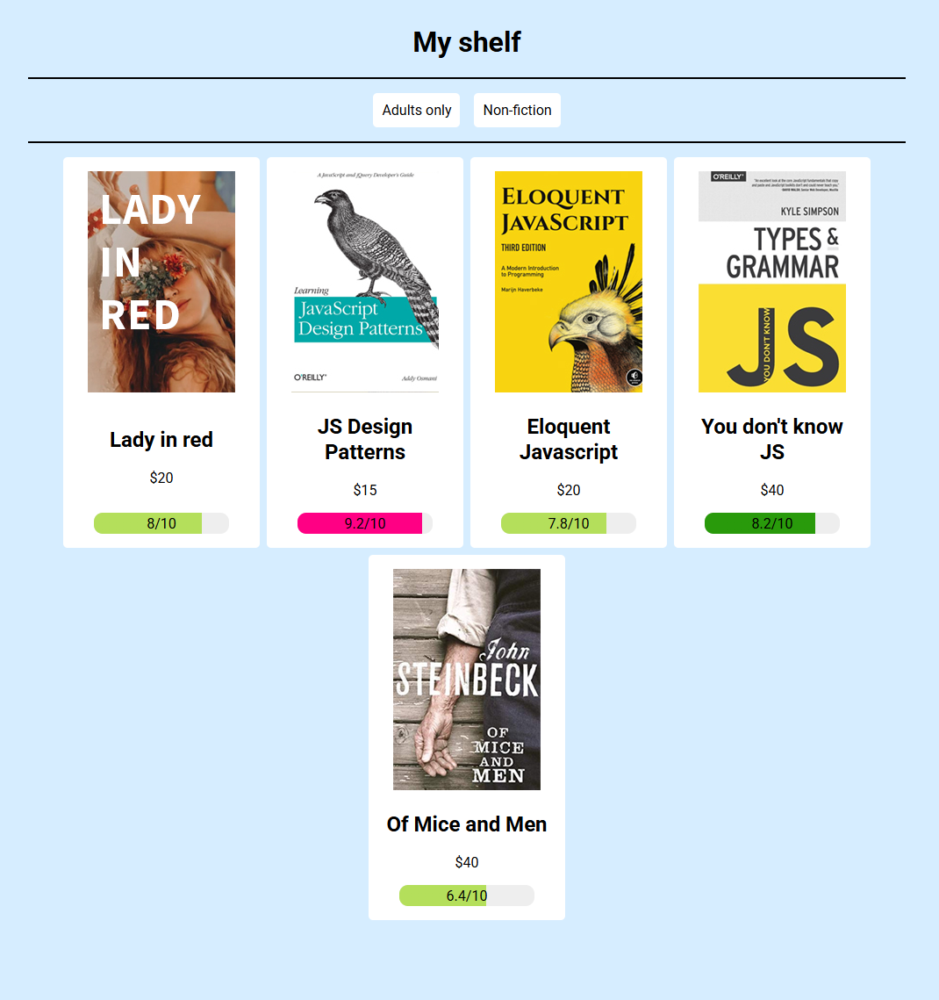

# English

## BookApp *'view'*

This is a simple book list application with filter support.
The project was primarily intended to familiarize/explore the basics of building applications and using Git.

The application was written using:
- SCSS / CSS,
- JavaScript,
- HTML,

Project needs to run:
- Node.js (tested on v24.12.0 windows),
- Git (tested on v2.52.0 windows), 

How to run:
```bash
npm run init-project

npm run watch
```

